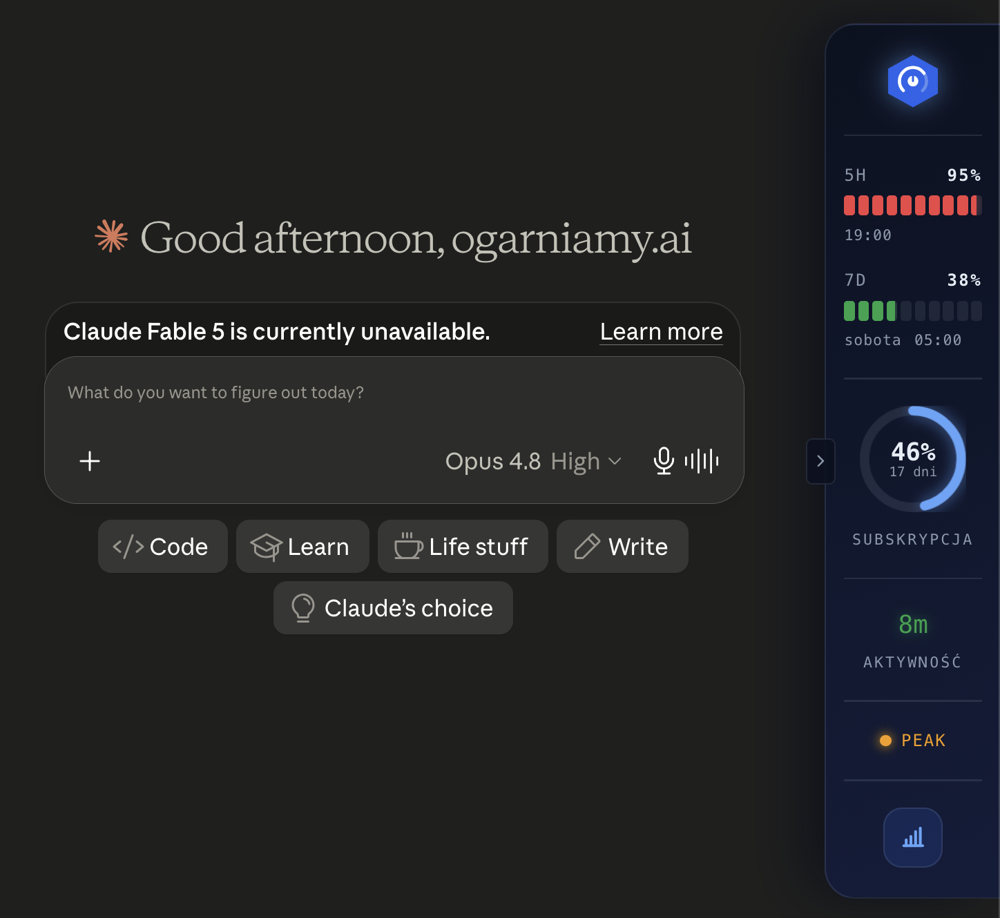
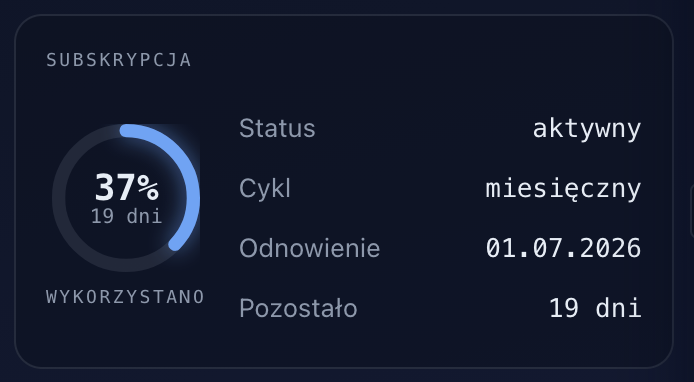
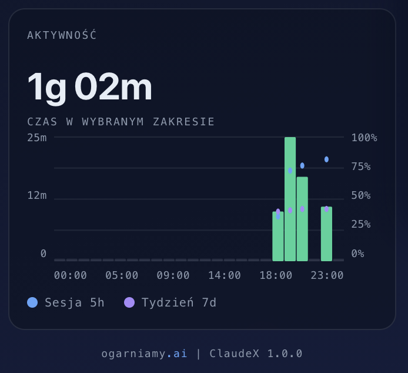
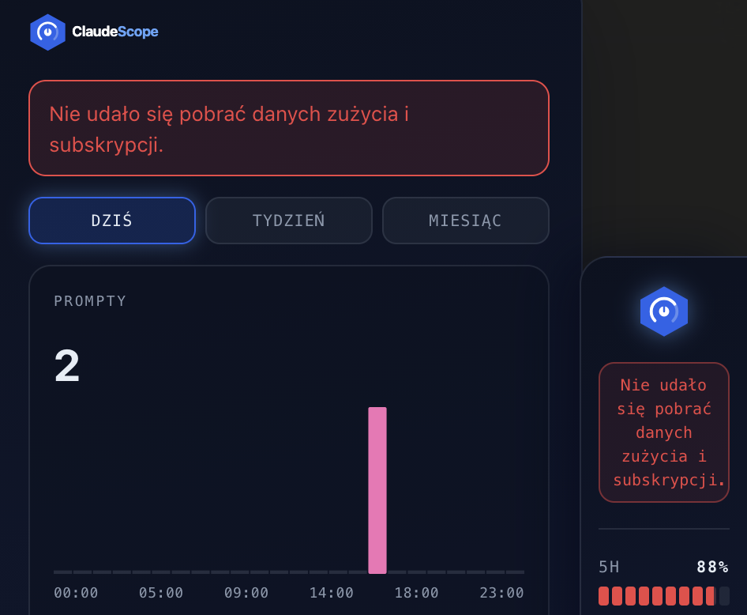

# ClaudeX

ClaudeX to wtyczka do przeglądarki, która pokazuje na bieżąco wszystko, co warto wiedzieć o swoim koncie claude.ai: wykorzystanie limitów, czas pracy, datę odnowienia subskrypcji, godziny szczytu. Wszystko liczy się lokalnie w Twojej przeglądarce, żadne dane nigdzie nie wychodzą.

Stworzone przez [ogarniamy.ai](https://ogarniamy.ai).

## Instalacja

Pobierz paczkę dla swojej przeglądarki z [najnowszej wersji](https://github.com/ogarniamyai/claudex/releases/latest).

### Chrome, Edge, Brave, Opera, Vivaldi, Arc

1. Pobierz `claudex-chrome-*.zip` i rozpakuj do dowolnego folderu (folder musi pozostać na dysku, bo przeglądarka ładuje wtyczkę bezpośrednio z niego).
2. Otwórz stronę zarządzania rozszerzeniami:
   - **Chrome**: wpisz `chrome://extensions` w pasku adresu
   - **Edge**: wpisz `edge://extensions`
   - **Brave**: wpisz `brave://extensions`
   - **Opera**: wpisz `opera://extensions`
3. W prawym górnym rogu włącz **„Tryb dewelopera"**.
4. Kliknij **„Załaduj rozpakowane"** i wskaż folder z rozpakowaną wtyczką.
5. Gotowe. Otwórz claude.ai, a panel pojawi się przy prawej krawędzi okna.

### Firefox

1. Pobierz `claudex-firefox-*.xpi`.
2. Otwórz plik w Firefoksie (przeciągnij na okno przeglądarki lub użyj **Plik → Otwórz plik**).
3. Potwierdź instalację w oknie dialogowym.
4. Gotowe. Otwórz claude.ai, a panel pojawi się przy prawej krawędzi okna.

**Aktualizacja**: aby zaktualizować wtyczkę, pobierz nowy plik `.xpi` i otwórz go w Firefoksie. Instalacja zostanie zaktualizowana automatycznie. W przeglądarkach Chromium wystarczy zastąpić pliki w folderze, z którego ładowana jest wtyczka, i kliknąć przycisk odświeżenia w `chrome://extensions`.

## Funkcjonalności

### Panel boczny

Po załadowaniu wtyczki na claude.ai przy prawej krawędzi okna pojawia się kompaktowy panel boczny. Jest zawsze widoczny i przedstawia najważniejsze informacje o Twoim koncie:

Od góry znajdują się:

- **Limit 5-godzinny**: pasek postępu z procentem wykorzystania oraz czasem do resetu.
- **Limit tygodniowy (7-dniowy)**: pasek postępu z procentem wykorzystania oraz czasem do resetu.
- **Cykl rozliczeniowy subskrypcji**: wskaźnik pokazujący odsetek wykorzystanych dni i liczbę dni pozostałych do odnowienia (kilka dni przed końcem cyklu wyświetla się ostrzeżenie).
- **Czas aktywności**: licznik czasu spędzonego w claude.ai. Liczy tylko wtedy, gdy karta jest aktywna i okno przeglądarki jest w użyciu.
- **Wskaźnik godzin szczytu**: informuje, czy aktualna pora to godziny szczytu (peak hours), w których prompty zużywają więcej z limitu.
- **Przycisk z ikoną wykresu**: otwiera panel ze szczegółowymi danymi.

Na lewej krawędzi panelu znajduje się **mała strzałka**, która zwija panel boczny do wąskiego paska. Przydaje się, gdy chcesz odsłonić więcej miejsca w interfejsie claude.ai, ale jednocześnie chcesz, aby wtyczka pozostała aktywna.

### Panel szczegółowy, prompty według modelu

Po kliknięciu przycisku z ikoną wykresu otwiera się panel szczegółowy. Sekcja **„PROMPTY"** prezentuje rozkład Twoich zapytań pomiędzy modele Claude:

- Procentowy udział każdego modelu w wysłanych zapytaniach.
- Łączna liczba wysłanych promptów.
- Szybki podgląd preferowanych modeli.

### Limity sesji

Sekcja **„LIMITY"** zawiera szczegółowe informacje o wykorzystaniu limitów:

- Procent wykorzystania limitu 5-godzinnego.
- Procent wykorzystania limitu 7-dniowego.
- Data i godzina najbliższego resetu każdego z limitów.
- Wyliczony czas pozostały do resetu.

### Szczegóły subskrypcji

Sekcja **„SUBSKRYPCJA"** informuje o aktualnym stanie Twojego planu:

- Nazwa i typ planu.
- Data odnowienia subskrypcji.
- Liczba dni pozostałych do końca cyklu.
- Status płatności oraz tryb rozliczeniowy.

### Mapa godzin szczytu

Sekcja **„PEAK HOURS"** przedstawia graficzny rozkład godzin szczytu w skali doby:

- Oś czasu obejmująca pełne 24 godziny.
- Żółte strefy oznaczają godziny szczytu.
- Anthropic potwierdziło, że w godzinach szczytu prompty zużywają więcej z limitu. Jeśli zależy Ci na oszczędzaniu, planuj intensywniejszą pracę poza tymi godzinami.

### Aktywność i wykorzystanie

Sekcja **„AKTYWNOŚĆ"** prezentuje historię Twojej pracy w claude.ai:

- Lewa oś: łączny czas spędzony w claude.ai w wybranym okresie.
- Kropki na wykresie: procent wykorzystania sesji w poszczególnych momentach.
- Najechanie kursorem na kropkę pokazuje dokładną wartość.
- Zakres można przełączać między widokiem dziennym, tygodniowym i miesięcznym.

### Komunikaty i alerty

Wtyczka odświeża dane z claude.ai automatycznie (domyślnie co 15 sekund). Jeżeli pojawi się problem z pobraniem danych, zostaniesz o tym poinformowany:

- Komunikat o błędzie pojawia się bezpośrednio na panelu bocznym.
- Ostatnia znana wartość pozostaje widoczna, dopóki nie uda się pobrać świeżych danych.
- Wtyczka samodzielnie ponawia próby połączenia w tle.
- Brakujące wartości są oznaczone myślnikiem, żeby nie wprowadzać w błąd zerami.

Sygnalizowane są również inne ważne komunikaty:

- **Komunikaty od autora wtyczki**: np. informacje o nowych wersjach lub istotne ostrzeżenia. Kolor ramki zależy od wagi: niebieska dla informacji, żółta dla ostrzeżeń.
- **Błędy połączenia z claude.ai**: gdy nie udaje się pobrać aktualnych danych, ramka komunikatu jest czerwona (zarówno na panelu bocznym, jak i w panelu szczegółowym).
- **Pulsujący przycisk menu** na panelu bocznym sygnalizuje, że pojawiła się informacja warta sprawdzenia.

## Prywatność

Wtyczka ma dostęp **wyłącznie do claude.ai**, do żadnej innej strony. Wszystkie obliczenia wykonują się lokalnie w Twojej przeglądarce, a dane nie są wysyłane na żaden zewnętrzny serwer. Bez kont, bez logowania, bez śledzenia.

Pełna polityka prywatności: [PRIVACY.md](PRIVACY.md).

## Licencja i znaki towarowe

Kod jest **publicznie widoczny wyłącznie dla transparencji**, żeby każdy mógł sprawdzić, że wtyczka nie wysyła nigdzie żadnych danych. To **nie jest open source**.

Możesz:
- zainstalować i używać oficjalnej wersji wtyczki ze sklepu Chrome lub Mozilla,
- czytać i sprawdzać kod źródłowy dla własnej oceny bezpieczeństwa.

Bez zgody ogarniamy.ai **nie wolno**:
- kopiować, modyfikować, tłumaczyć ani tworzyć prac pochodnych kodu,
- publikować forka, klona ani przepakowanej wersji wtyczki w sklepie lub gdziekolwiek indziej,
- używać nazwy „ClaudeX", „ogarniamy.ai" ani znaku marki w innych produktach.

Pełny tekst: [LICENSE](LICENSE). Pull requesty nie są przyjmowane. Błędy i sugestie zgłaszaj przez [issues na GitHubie](https://github.com/ogarniamyai/claudex/issues).
